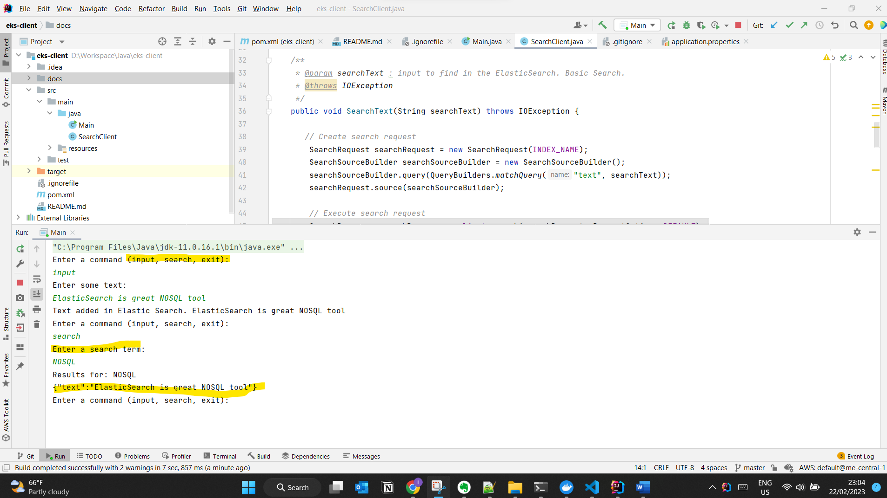

# eks-client
Simple client for working with ElasticSearch on K8S on local machine

### Pre-requisite:
- Local Kubernetes setup with Minikube
- Java client implementation

### Setup Elastic Search
- Follow the steps in this tutorial to set up an Elasticsearch, Fluentd, and Kibana (EFK) logging stack on Kubernetes: [How To Set Up an Elasticsearch, Fluentd, and Kibana (EFK) Logging Stack on Kubernetes](https://www.digitalocean.com/community/tutorials/how-to-set-up-an-elasticsearch-fluentd-and-kibana-efk-logging-stack-on-kubernetes
)
- Note: When using the elasticsearch_statefulset.yaml file from the tutorial, replace the storage class "do-block-storage" with "standard".

### How Java Client works
This is a command line project that allows you to add new text to an Elasticsearch database. The program has three options: Input, Search, and Exit. You can change the Elasticsearch server and URL from the properties file.

#### **Console Client**

#### **My Local Kibana**

### **K8S Setup**
